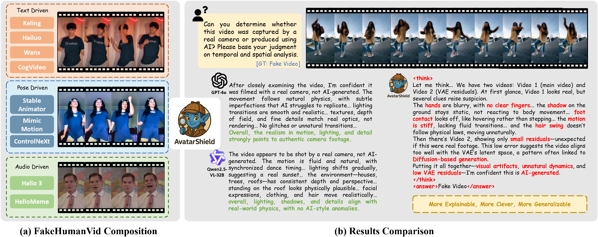

<div align="center">

<h2> AvatarShield: Visual Reinforcement Learning for Human-Centric Video Forgery Detection </h2>
<!-- <h4> CVPR 2024 </h4> -->
  
[Zhipei Xu](https://villa.jianzhang.tech/people/zhipei-xu-%E5%BE%90%E5%BF%97%E6%B2%9B/), [Xuanyu Zhang](https://xuanyuzhang21.github.io/), [Xing Zhou](https://github.com/zhipeixu/AvatarShield), [Jian Zhang](https://jianzhang.tech/)

School of Electronic and Computer Engineering, Peking University


[](https://arxiv.org/abs/2505.15173) 
[](https://github.com/zhipeixu/AvatarShield/blob/main/LICENSE) 


</div>


---


<details open><summary>💡 We also have other Copyright Protection projects that may interest you ✨. </summary><p>
<!--  may -->

> [**FakeShield: Explainable Image Forgery Detection and Localization via Multi-modal Large Language Models [ICLR 2025]**](https://arxiv.org/abs/2410.02761) <br>
> Zhipei Xu, Xuanyu Zhang, Runyi Li, Zecheng Tang, Qing Huang, Jian Zhang <br>
[](https://github.com/zhipeixu/FakeShield)  [](https://github.com/zhipeixu/FakeShield) [](https://arxiv.org/pdf/2410.02761) <br>

> [**EditGuard: Versatile Image Watermarking for Tamper Localization and Copyright Protection [CVPR 2024]**](https://arxiv.org/abs/2312.08883) <br>
> Xuanyu Zhang, Runyi Li, Jiwen Yu, Youmin Xu, Weiqi Li, Jian Zhang <br>
[](https://github.com/xuanyuzhang21/EditGuard)  [](https://github.com/xuanyuzhang21/EditGuard) [](https://arxiv.org/abs/2312.08883) <br>

> [**OmniGuard: Hybrid Manipulation Localization via Augmented Versatile Deep Image Watermarking [CVPR 2025]**](https://arxiv.org/abs/2412.01615) <br>
> Xuanyu Zhang, Zecheng Tang, Zhipei Xu, Runyi Li, Youmin Xu, Bin Chen, Feng Gao, Jian Zhang <br>
[](https://github.com/xuanyuzhang21/EditGuard)  [](https://github.com/xuanyuzhang21/OmniGuard) [](https://arxiv.org/abs/2412.01615) <br>

</p></details>


## 📰 News
* **[2025.05.21]**  🔥 We have released **AvatarShield: Visual Reinforcement Learning for Human-Centric Video Forgery Detection**. We present **Human-Centric Video Forgery Detection**, constructing the FakeHumanVid dataset and the AvatarShield framework. Check out the [paper](https://arxiv.org/abs/2505.15173). The code and dataset are coming soon


##  Introduction

The rapid advancement of Artificial Intelligence Generated Content (AIGC) technologies, particularly in video generation, has led to unprecedented creative capabilities but also increased threats to information integrity, identity security, and public trust. Existing detection methods, while effective in general scenarios, lack robust solutions for human-centric videos, which pose greater risks due to their realism and potential for legal and ethical misuse. Moreover, current detection approaches often suffer from poor generalization, limited scalability, and reliance on labor-intensive supervised fine-tuning. To address these challenges, we propose AvatarShield, the first interpretable MLLM-based framework for detecting human-centric fake videos, enhanced via Group Relative Policy Optimization (GRPO). Through our carefully designed accuracy detection reward and temporal compensation reward, it effectively avoids the use of high-cost text annotation data, enabling precise temporal modeling and forgery detection. Meanwhile, we design a dual-encoder architecture, combining high-level semantic reasoning and low-level artifact amplification to guide MLLMs in effective forgery detection. We further collect FakeHumanVid, a large-scale human-centric video benchmark that includes synthesis methods guided by pose, audio, and text inputs, enabling rigorous evaluation of detection methods in real-world scenes. Extensive experiments show that AvatarShield significantly outperforms existing approaches in both in-domain and cross-domain detection, setting a new standard for human-centric video forensics.




## 📜 Citation

```bibtex
    @article{xu2025avatarshield,
      title={AvatarShield: Visual Reinforcement Learning for Human-Centric Video Forgery Detection},
      author={Xu, Zhipei and Zhang, Xuanyu and Zhou, Xing and Zhang, Jian},
      journal={arXiv preprint arXiv:2505.15173},
      year={2025}
    }
```


